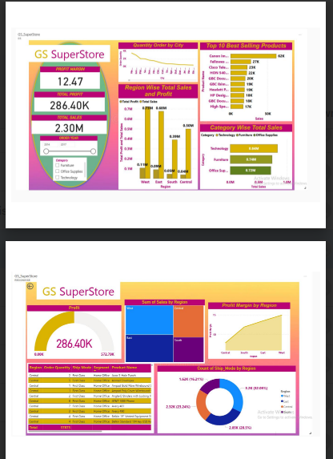

# 📊 GS SuperStore Performance Dashboard

Thrilled to share my latest project: the **GS SuperStore Performance Dashboard**, designed to provide a comprehensive overview of **sales and profit performance** across categories, regions, and products. This dashboard highlights my ability to leverage **Power BI’s advanced features** to deliver actionable insights for decision-makers.

---

## 🔹 Tools Used
- Power BI  
- DAX  
- Data Modeling  
- Advanced Visualization Techniques  

---

## 🔹 Dashboard Preview

---

## 🔹 Key Insights

✔️ **Total Sales**: $2.30M  
✔️ **Total Profit**: $286.40K  
✔️ **Profit Margin**: 12.47%  
✔️ **Top-Selling Product**: Canon image CLASS with $62K in sales  
✔️ **Highest Performing Region**: West with $0.7M in total sales  

---

## 🚀 Features
- Comprehensive **sales & profit KPIs** at a glance  
- Drill-down analysis by **categories, products, and regions**  
- Interactive and dynamic Power BI dashboard  
- Enhanced decision-making through **data-driven insights**  

---

## 📌 About the Project
This project demonstrates my skills in **business intelligence, data visualization, and analytics**. The dashboard is designed to empower leadership teams with real-time insights into profitability, sales distribution, and top-performing products.

---

## 📂 How to Use
1. Clone this repository.  
2. Open the Power BI (.pbix) file in Power BI Desktop.  
3. Explore the interactive dashboard and filters.  

---
